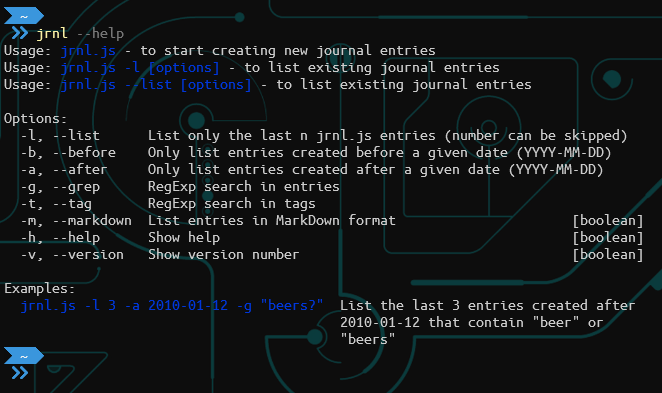
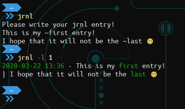
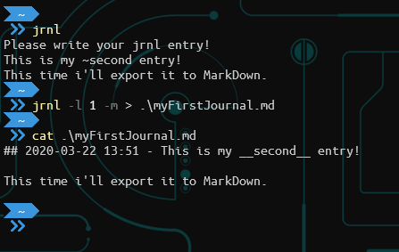

 

# jrnl.js - Command line journal

_jrnl.js_ is a command line journal application based on [jrnl.sh](https://jrnl.sh/).

Since reading [this article](https://ardalis.com/keeping-a-work-journal) from Ardalis and [The Unicorn Project](https://itrevolution.com/the-unicorn-project/) I kept going back to the thought that I should keep a work journal.
I also like using the command line whenever possible and really liked the idea of a command line journal app like [jrnl.sh](jrnl.sh).
However since I was looking for hobby project ideas I thought I'd just write something similar using [Node.js](https://nodejs.org/en/) for myself, just for the heck of it.
I'm also quite happy to share it with anyone who's interested or would like to try it out.

My main goals for this project were:

- Have a very simple and easy to use application working from the command line
- Try writing most of it using functional programming style
  - One of my reasons to embark on a hobby project was to practice some functional programming
  - It may not be perfect at the time, but I'm trying to chisel away any non-functional parts as I go along
- Not to spend too much time on it
  - I mostly work on this on quiet weekday evenings, which I don't have too much, thus I can't work on it too much 😊

## Installation

Currently this is not yet an npm package, so you'll only need to clone the project and install the npm dependencies.

```bash
git clone https://github.com/bothzoli/jrnl.js.git;
npm install;
```

After this you can start using it from the download folder by prefixing all commands with `node` (e.g.: `node jrnl --list`).

You can also use `npm link` to create a symlink in your global folder (see the [documentation](https://docs.npmjs.com/cli/link.html) on `npm link`).
After this you should be able to use `jrnl` as if it were globally installed.

I am planning to release this as an npm package in the near future.

## What it does and how to use it

You can use this tool to write journal entries from the command line.
The entries will be saved in an `entries.json` file in a folder of choice based on the settings in the `settings.js` file.

Use the help to get info (`jrnl --help` or `jrnl -h`).



### Write a new entry

To write a new journal entry just start the app with `npm start` or if you have it installed globally just type `jrnl`.
This will prompt you for a new journal entry.

The first sentence or line you write will be considered as the title of the journal entry.
The rest will be considered as the content of the journal entry.

You can tag words which will be highlighted when you print your journal entries.
To have a word tagged just prefix it with the tag character set in `settings.js` file (by default it is the `~` character).

The the format of timestamps and the highlight color of tags and timestamps can be changed in `settings.js`.



For colors you can use the colors defined in the [chalk](https://github.com/chalk/chalk) npm package.

For timestamp format you can use the formats defined in the [moment.js](https://momentjs.com/docs/#/displaying/format/) npm package.

### List entries

To list your entries you should use the `-l` / `--list` option.
This option also supports number, i.e. only the last `n` entries will be displayed if a number is provided.
If no number is provided, all entries will be displayed.

The options `-b` / `--before` and `-a` / `--after` will take a date as input (the date format is `YYYY-MM-DD`) and restrict the entries to those that adhere to the search criteria.

Options `-g` / `--grep` and `-t` / `--tag` provide regular expression search on entries and tags respectfully.

### Export to MarkDown

The `-m` / `--markdown` option will print the entries using MarkDown formatting.
You can pipe the output of this to a markdown file and than display it with your favorite markdown editor or push to a private GitHub repository so you can read your journal entries wherever you'd like to.



## Contributing

To be written...

But in the meantime, if you'd like to help or have issues, please feel free to open an issue or a pull request.
You can also DM me on [Twitter](https://twitter.com/bothzoli).
